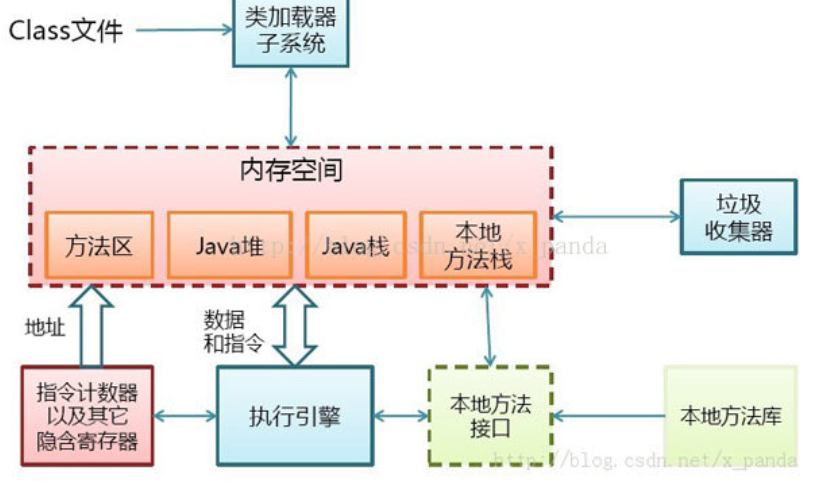
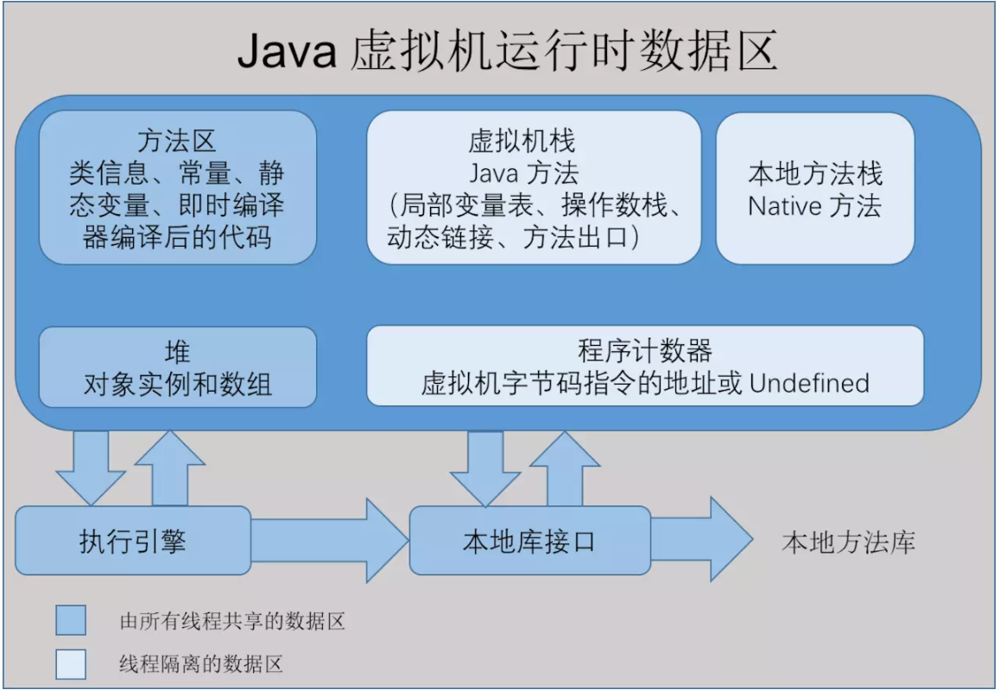
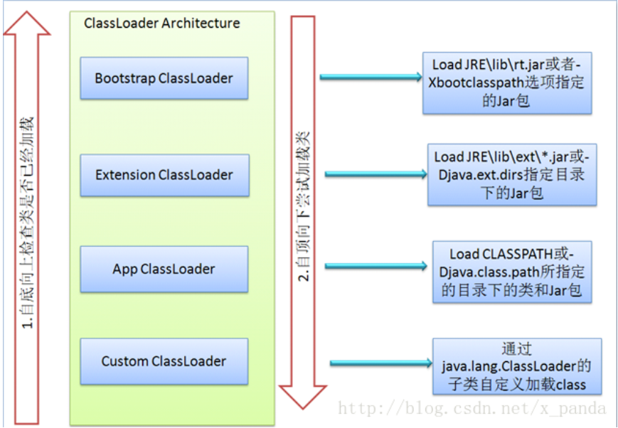
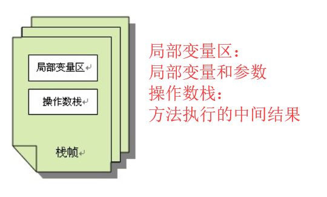

# JVM工作原理和流程

[参考文章1](https://blog.csdn.net/qq_33384065/article/details/80282023)
[参考文章2](https://blog.csdn.net/qq_41701956/article/details/81664921)
[参考文章3（详细）](https://blog.csdn.net/csdnliuxin123524/article/details/81303711)

# java虚拟机的体系结构

当Java程序启动的时候，就产生JVM的一个实例；当程序运行结束的时候，该实例也跟着消失了
-  **每个jvm都有的两种机制:**
1. 类装载子系统: 装载类和接口
2. 执行引擎: 执行已经装载的类或者接口中的方法
- **每个jvm都包含:**
方法区, java堆, java栈,本地方法栈, 指令计数器, 其他隐含寄存器

# java代码编译和执行的过程
Java代码的编译和执行的整个过程大概是：开发人员编写Java代码(.java文件)，然后将之编译成字节
码(.class文件)，再然后字节码被装入内存，一旦字节码进入虚拟机，它就会被解释器解释执行，或
者是被即时代码发生器有选择的转换成机器码执行。
Java代码编译和执行的整个过程包含了以下三个重要的机制:

·**Java源码编译机制**

·**类加载机制**

最上层 bootstrap ClassLoader c++实现，不是ClassLoader子类
加载过程中会先检查类是否被已加载，检查顺序是自底向上，从Custom ClassLoader到BootStrap 
ClassLoader逐层检查，只要某个classloader已加载就视为已加载此类，保证此类只所有ClassLoader
加载一次。而加载的顺序是自顶向下，也就是由上层来逐层尝试加载此类。
·**类执行机制**

就是通过对堆栈的操作来完成的。堆栈以帧为单位保存线程的状态。JVM对堆栈只进行两种操作:以帧为单位的压栈和出栈操作。

JVM执行class字节码，线程创建后，都会产生程序计数器（PC）和栈（Stack），程序计数器存放下
一条要执行的指令在方法内的偏移量，栈中存放一个个栈帧，每个栈帧对应着每个方法的每次调
用，而栈帧又是有局部变量区和操作数栈两部分组成，局部变量区用于存放方法中的局部变量和参
数，操作数栈中用于存放方法执行过程中产生的中间结果。栈的结构如下图所示：

# jvm内存管理和垃圾回收
jvm内存结构分为：堆，栈，本地方法栈，方法区。下面是对这四个的详细介绍
1. 堆(heap)
所有通过new创建的对象的地址都在堆中。操作系统通过一个链表保存系统中的空闲地址，然后当需
要分配地址的时候，遍历链表找到第一个>=需要的大小的地址块，然后记录一下这一个地址块的开
始地址，方便在之后delete的时候能快速找到，然后将预计分配地址-实际需要=剩下的地址块重新加
入空闲地址链表，实际就是首次适配算法（[复习操作系统内存分配](https://blog.csdn.net/Fly_as_tadpole/article/details/86568871))。
2. 栈(stack)
在Windows下, 栈是向低地址扩展的数据结构，是一块连续的内存区域。这句话的意思是栈顶的地址
和栈的最大容量是系统预先规定好的，在WINDOWS下，栈的大小是固定的（是一个编译时就确定
的常数），如果申请的空间超过栈的剩余空间时，将提示overflow。因此，能从栈获得的空间较小。
只要栈的剩余空间大于所申请空间，系统将为程序提供内存，否则将报异常提示栈溢出。 由系统自
动分配，速度较快。但程序员是无法控制的。
**需要注意的地方**:
基本数据类型，方法的形参——栈
引用+new创建 | 方法的引用参数 | ——栈（地址），堆（数据）
new创建的局部变量 ——栈（数据），堆（数据）。生命周期结束时，栈立刻回收，堆等待gc回收
字符串常量，static ——data域
this —— 堆
数组 —— 栈（名称），堆（实际大小）
3. 本地方法栈（java的ini调用）
用于支持native方法的执行，存储了每个native方法调用的状态。对于本地方法接口，实现JVM并不
要求一定要有它的支持，甚至可以完全没有。Sun公司实现Java本地接口(JNI)是出于可移植性的考
虑，当然我们也可以设计出其它的本地接口来代替Sun公司的JNI。但是这些设计与实现是比较复杂
的事情，需要确保垃圾回收器不会将那些正在被本地方法调用的对象释放掉。
4. 方法区
它保存方法代码(编译后的java代码)和符号表。存放了要加载的类信息、静态变量、final类型的常
量、属性和方法信息。JVM用持久代（Permanet Generation）来存放方法区，可通过-XX:PermSize
和-XX:MaxPermSize来指定最小值和最大值。

## 垃圾回收
java的垃圾回收都是由gc来做的，java只有new，没有delete，所有的都是gc处理，更加安全好用，但是效率是个问题

