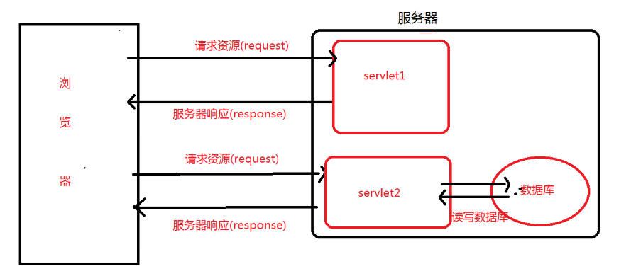
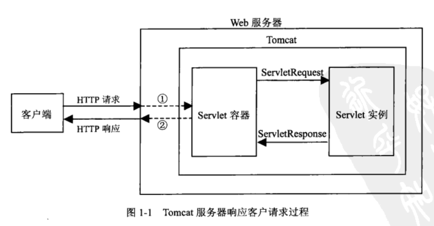

# Servlet/Jsp

这是学习javaweb的起点,其实有了新的技术之后可以不用管已经不再用的东西,但是了解之前的东西是怎么回事还是很有必要的.
[参考资料1](https://www.cnblogs.com/whgk/p/6399262.html)
[参考资料2](https://blog.csdn.net/zdb292034/article/details/81879842)
[参考资料3](https://www.jianshu.com/p/ac09b3c52870)
# 什么是Servlet
Servlet是为了解决实现动态界面产生的一种东西,应用图如下:

下面是一次响应请求流程的图：

