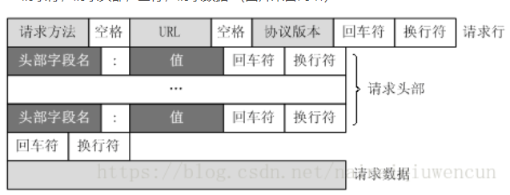
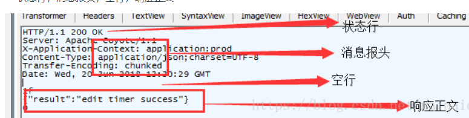

# http
[参考文章](https://www.cnblogs.com/phpper/p/9127553.html)
# 简介
HTTP（Hyper Text Transfer Protocol）是一个基于TCP/IP通信协议来传递数据，包括html文件、图像、结果等的协议，即是一个客户端和服务器端请求和应答的标准。
# 特点
1.http无连接：限制每次连接只处理一个请求，服务端完成客户端的请求后，即断开连接。（传输速度快，减少不必要的连接，但也意味着每一次访问都要建立一次连接，效率降低）

2.http无状态：对于事务处理没有记忆能力。每一次请求都是独立的，不记录客户端任何行为。（优点解放服务器，但可能每次请求会传输大量重复的内容信息）

3.客户端/服务端模型：客户端支持web浏览器或其他任何客户端，服务器通常是apache或者iis等

4.简单快速

5.灵活：可以传输任何类型的数据
# 消息格式
- 客户端请求消息

- 服务器响应消息

# http方法
1. **GET**
发送请求来获得服务器上的资源，请求体中不会包含请求数据，请求数据放在协议头中。
另外get支持快取、缓存、可保留书签等。幂等
2. **POST**
和get一样很常见，向服务器提交资源让服务器处理，比如提交表单、上传文件等，可能导致建立新的资源或者对原有资源的修改。
提交的资源放在请求体中。不支持快取。非幂等
3. **HEAD**
本质和get一样，但是响应中没有呈现数据，而是http的头信息.
主要用来检查资源或超链接的有效性或是否可以可达、检查网页是否被串改或更新，获取头信息等，特别适用在有限的速度和带宽下。
4. **PUT**
和post类似，html表单不支持，发送资源与服务器，并存储在服务器指定位置，要求客户端事先知道该位置；
比如post是在一个集合上（/province），而put是具体某一个资源上（/province/123）。
所以put是安全的，无论请求多少次，都是在123上更改，而post可能请求几次创建了几次资源。幂等
5. **DELETE**
请求服务器删除某资源。和put都具有破坏性，可能被防火墙拦截。如果是https协议，则无需担心。幂等
6. **CONNECT**
HTTP/1.1协议中预留给能够将连接改为管道方式的代理服务器。就是把服务器作为跳板，去访问其他网页然后把数据返回回来，连接成功后，就可以正常的get、post了。
7. **OPTIONS**
获取http服务器支持的http请求方法，允许客户端查看服务器的性能，比如ajax跨域时的预检等。
8. **TRACE**
回显服务器收到的请求，主要用于测试或诊断。一般禁用，防止被恶意攻击或盗取信息。