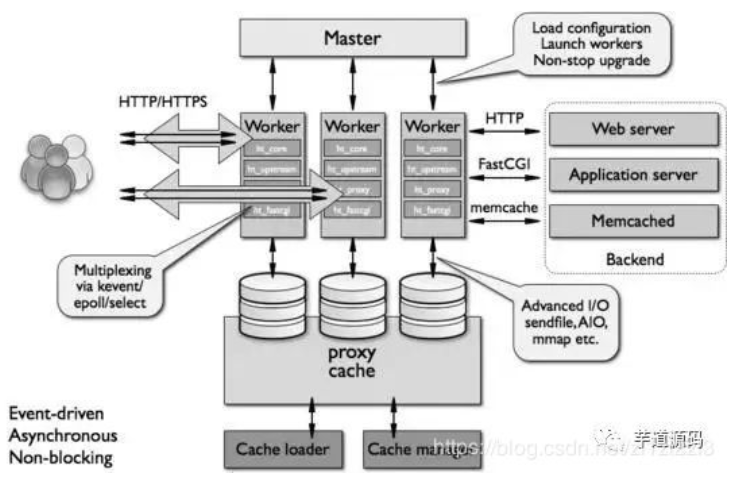
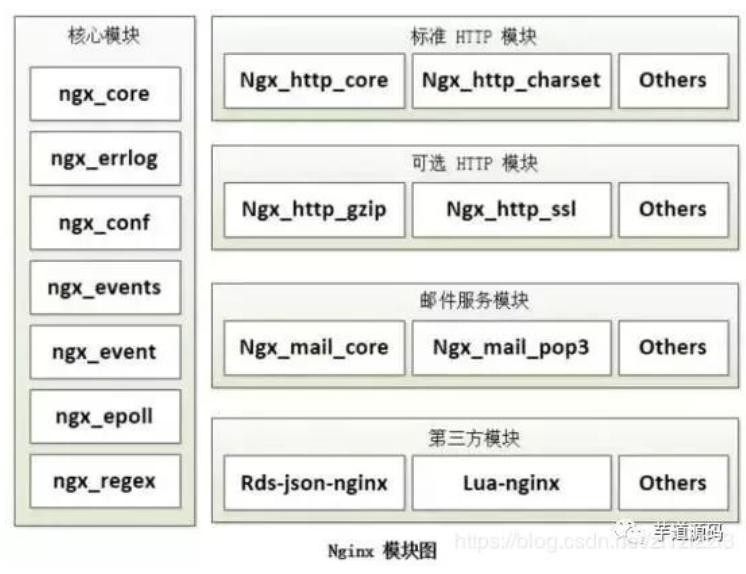
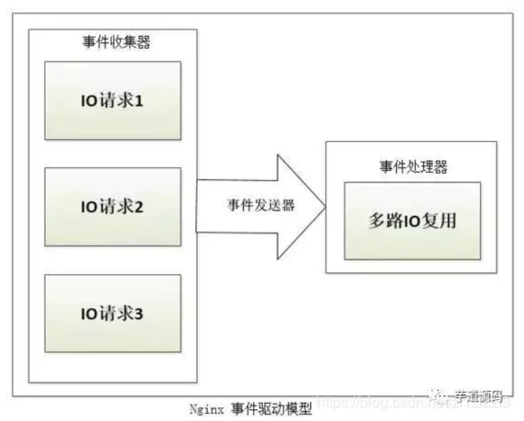
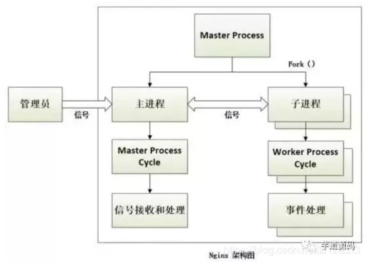

# nginx
[参考文章1: 介绍](https://blog.csdn.net/zl1zl2zl3/article/details/88850041)(本文总结)
请在看完这篇文章后看之后的文章
[参考文章2: 能做什么](https://blog.csdn.net/zl1zl2zl3/article/details/84502964)
[参考文章3: 怎么用](https://blog.csdn.net/zl1zl2zl3/article/details/90262289)
[参考文章4: 实战1](https://blog.csdn.net/zl1zl2zl3/article/details/87982487)
[参考文章5: 实战2](https://blog.csdn.net/zl1zl2zl3/article/details/88999258)

Nginx---Ngine X，是一款免费的、自由的、开源的、高性能HTTP服务器和反向代理服务器；
也是一个IMAP、POP3、SMTP代理服务器；
Nginx以其高性能、稳定性、丰富的功能、简单的配置和低资源消耗而闻名。
到底能做什么: **1.反向代理 2.静态服务器 3.负载均衡**

也就是说Nginx本身就可以托管网站（类似于Tomcat一样），进行Http服务处理，也可以作为反向代理服务器 、负载均衡器和HTTP缓存。
Nginx 解决了服务器的C10K（就是在一秒之内连接客户端的数目为10k即1万）问题。
它的设计不像传统的服务器那样使用线程处理请求，而是一个更加高级的机制—**事件驱动机制**，是一种异步事件驱动结构。
# nginx的特点
- **跨平台**：可以在大多数Unix like 系统编译运行。而且也有Windows的移植版本。
- **配置异常简单**：非常的简单，易上手。
- **非阻塞、高并发连接**：数据复制时，磁盘I/O的第一阶段是非阻塞的。官方测试能支持5万并发连接，实际生产中能跑2~3万并发连接数（得益于Nginx采用了最新的epoll事件处理模型（消息队列）。
- Nginx代理和后端Web服务器间无需长连接；
- **Nginx接收用户请求是异步**的，即先将用户请求全部接收下来，再一次性发送到后端Web服务器，极大减轻后端Web服务器的压力。
- 发送响应报文时，是边接收来自后端Web服务器的数据，边发送给客户端。
- 网络依赖性低，理论上只要能够ping通就可以实施负载均衡，而且可以有效区分内网、外网流量。
- **支持内置服务器检测**。Nginx能够根据应用服务器处理页面返回的状态码、超时信息等检测服务器是否出现故障，并及时返回错误的请求重新提交到其它节点上。
- **内存消耗小、成本低廉（比F5硬件负载均衡器廉价太多）、节省带宽、稳定性高**等特点。

# nginx结构

1. **模块化设计**
Nginx 的Worker 进程，包括核心和功能性模块 .
**核心模块**负责维持一个**运行循环（ run-loop ）**，执行网络请求处理的不同阶段的模块功能，比如：存储读写、内容传输 、网络读写 、外出过滤 ，以及将请求发往上游服务器等。
而其代码的模块化设计 ，也使得我们可以根据需要对**功能模块**进行适当的选择和修改 ，编译成具有特定功能的服务器。
2. **代理设计**
代理（proxy）设计，可以说是 Nginx 深入骨髓的设计，无论是对于HTTP，还是对于Memcache 、Redis、FastCGI 等的网络请求或响应，本质上都采用了代理机制 。所以，Nginx 天生就是高性能的代理服务器 。
3. **事件驱动模型**
异步+非阻塞是nginx获得高并发高性能的关键, I/O采用select,poll,epoll
4. **主进程模型**
Nginx 启动时，会生成两种类型的进程，一个是**主进程 （ Master ）**， **一个或多个工作进程 （ Worker ）**。
主进程并不处理网络请求，主要负责调度工作进程 ，也就是图示的3项：加载配置 、 启动工作进程及非停升级。
所以Nginx启动以后，查看操作系统的进程列表，我们就能看到至少有两个Nginx进程。
5. **工作进程模型**
服务器**实际处理网络请求及响应的是工作进程**，在类Unix 系统上，Nginx可以配置多个Worker ，而每个Worker 进程都可以同时处理数以千计的网络请求。
# nginx模块化设计

每个模块完成自己的功能,高内聚,低耦合
**核心**: nginx相关配置等
**http**: 解析http相关东西
**可选http**: http的扩展,如ssl, flash传输等
**邮箱**: smtp pop3 imap的支持
**拓展**: json,lua支持等
# 正向和反向代理
- **正向**: 就是我们平时用的vpn,比如要访问google,开vpn就是一个正向代理,我们最终访问到google的时候,google不知道我们客户端实际上是哪一个,只知道我们使用的代理可能是日本的一个客户端,并不知道实际的客户端.
客户端必须设置正向代理服务器，当然前提是要知道正向代理服务器的IP地址，还有代理程序的端口。
- **反向**:针对服务器的,就像10086,我们打10086,这个号码就像是一个反向代理,我们不知道给我们服务的客服实际谁,只知道拨打了10086这个号就可以了.
10086内部要根据我们打电话的人是哪个城市,分配给我们那个城市地区的空闲的接线员
反向代理正好与正向代理相反，对于客户端而言代理服务器就像是原始服务器，并且客户端不需要进行任何特别的设置。
客户端向反向代理的命名空间（name-space）中的内容发送普通请求，接着反向代理将判断向何处（原始服务器）转交请求，并将获得的内容返回给客户端。
# nginx事件驱动模型

在 Nginx 的**异步非阻塞机制**中，工作进程在调用 IO 后，就去处理其他的请求，当 IO 调用返回后，会通知该工作进程 。对于这样的系统调用，主要使用 Nginx 服务器的事件驱动模型来实现。
如上图所示， Nginx 的 事件驱动模型由**事件发送器、事件收集器和事件处理器**三部分基本单元组成：

- 事件发送器：负责将 IO 事件发送到事件处理器 ；

- 事件收集器：负责收集Worker 进程的各种 IO 请求；

- 事件处理器：负责各种事件的响应工作 。

事件发送器将每个请求放入一个 待处理事件列表 ，使用非阻塞 I/O 方式调用 事件处理器来处理该请求。其处理方式称为 “**多路 IO 复用方法**” ，常见的包括以下三种： select 模型、 poll模型、 epoll 模型。
# nginx事件处理方式
1. **多进程**
服务器每当收到一个客户端时，就有**服务器主进程 （ master process ）生成一个 子进程（(worker process )**出来和客户端建立连接进行交互，直到连接断开，该子进程就结束了。
使用进程的好处是各个**进程之间相互独立，不需要加锁，减少了使用锁对性能造成影响**，同时降低编程的复杂度，降低开发成本。其次，采用独立的进程，可以让**进程互相之间不会影响 ，如果一个进程发生异常退出时，其它进程正常工作， master 进程则很快启动新的 worker 进程，确保服务不会中断**，从而将风险降到最低。
缺点是操作系统**生成一个子进程需要进行 内存复制等操作，在资源和时间上会产生一定的开销。当有大量请求时，会导致系统性能下降 **。
2. **异步非阻塞**
每个工作进程 使用**异步非阻塞方式 **，可以处理 多个客户端请求 。
当某个 工作进程 接收到客户端的请求以后，调用 IO 进行处理，如果不能立即得到结果，就去 处理其他请求 （即为 非阻塞 ）；
而 客户端 在此期间也 无需等待响应 ，可以去处理其他事情（即为 异步 ）。
当 IO 返回时，就会通知此 工作进程 ；该进程得到通知，暂时 挂起 当前处理的事务去 响应客户端请求 。
# nginx进程处理模式
主进程创建后,for循环不断读读客户端请求,读到请求后fork一个worker进程
worker进程创建后,也在一个for循环中处理对nginx服务器的请求

一般推荐 **worker 进程数与CPU内核数一致**，这样一来不存在大量的子进程生成和管理任务，避免了进程之间竞争CPU 资源和进程切换的开销。
而且 Nginx 为了更好的利用 多核特性 ，提供了 CPU 亲缘性的绑定选项，我们可以将某一个进程绑定在某一个核上，这样就不会因为进程的切换带来 Cache 的失效。

对于每个请求，**有且只有一个工作进程 对其处理**。首先，每个 worker 进程都是从 master进程 fork 过来。在 master 进程里面，先建立好需要 listen 的 socket（listenfd） 之后，然后再 fork 出多个 worker 进程。

所有 worker 进程的 listenfd 会在新连接到来时变得可读 ，为保证只有一个进程处理该连接，所有 worker 进程在注册 listenfd 读事件前**抢占 accept_mutex** ，抢到互斥锁的那个进程注册 listenfd 读事件 ，在读事件里调用 accept 接受该连接。

当一个 worker 进程在 accept 这个连接之后，就开始读取请求、解析请求、处理请求，产生数据后，再返回给客户端 ，最后才断开连接。这样一个完整的请求就是这样的了。我们可以看到，**一个请求，完全由 worker 进程来处理，而且只在一个 worker 进程中处理**。

**外界到主进程**的通信是一个**单向通道的**socket通道,信号量从外到主进程
**主进程到从进程是双向通道**也是的通过socket实现
**从进程之间相互隔离**,从一个从进程发往另一个,需要把另一个的进程id发给主进程,然后再给那个从进程.

