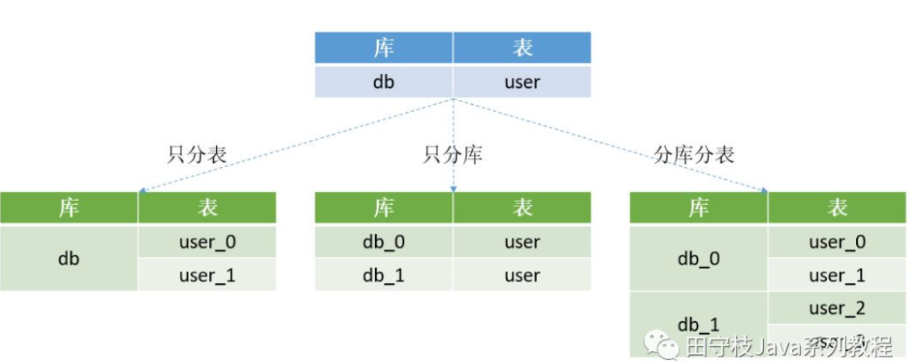

# 数据库中间件

[参考文章](https://blog.csdn.net/zl1zl2zl3/article/details/88814140)

# 数据库的拆分和面临的挑战

## 1. 垂直拆分

垂直拆分，指的是将一个包含了很多表的数据库，根据表的功能的不同，拆分为多个小的数据库，每个库包含部分表。就相当于亚信的ins1.xxx, bassi.xxxx
垂直拆分，都是根据业务来对一个库中的表进行拆分的。关于垂直拆分，还有另一种说法，将一个包含了很多字段的大表拆分为多个小表，每个表包含部分字段，这种情况在实际开发中基本很少遇到。
垂直拆分的另一个典型应用场景是服务化(SOA)改造。在服务化的背景下，除了业务上需要进行拆分，底层的存储也需要进行隔离。 
垂直拆分会使得单个用户请求的响应时间变长，原因在于，在单体应用的场景下，所有的业务都可以在一个节点内部完成，而垂直拆分之后，通常会需要进行[RPC](https://baijiahao.baidu.com/s?id=1637758852641939872&wfr=spider&for=pc)调用。然后虽然单个请求的响应时间增加了，但是整个服务的吞吐量却会大大的增加。

## 2. 读写分离
**2.1 读写分离的概念**
用户数量和并发量不断上升。这时如果仅靠单个数据库实例来支撑所有访问压力,几乎是在自寻死路 
以产品库为例，可能库中包含了几万种商品，并且每天新增几十种，而产品库每天的访问量可能有几亿甚至几十亿次。数据库读的压力太大，单台mysql实例扛不住，此时大部分 Mysql DBA 就会将数据库设置成 读写分离状态 。
也就是一个 **Master 节点(主库)对应多个 Slave 节点(从库)。可以将slave节点的数据理解为master节点数据的全量备份。**
对内容的修改会让主节点的数据进行改动，然后通过一张表存那些东西进行了改动，然后从节点对主节点数据库的内容进行复制，保证数据一致性。
master节点接收用户的写请求，并写入到本地二进制文件(binary log)中。slave通过一个I/O线程与Master建立连接，发送binlog dump指令。
Master会将binlog数据推送给slave，slave将接收到的binlog保存到本地的中继日志(relay log)中，最后，slave通过另一个线程SQL thread应用本地的relay log，将数据同步到slave库中。
关于mysql主从复制，内部包含很多细节。
**例如binlog 格式分为statement、row和mixed，binlog**
**同步方式又可以划分为：异步、半同步和同步。
复制可以基于binlogFile+position，也可以基于GTID。**
通常，这些都是DBA负责维护的，业务RD无感知。
写代码的人只要注意，更新数据到master节点，读数据到slave节点
**2.2  读写分离面临的挑战**
- 对DBA来说:
例如集群搭建、主从切换、从库扩容、缩容等。例如master配置了多个slave节点，如果其中某个slave节点挂了，那么之后的读请求，我们应该将其转发到正常工作的slave节点上。另外，如果新增了slave节点，应用也应该感知到，可以将读请求转发到新的slave节点上。
- 对程序员来说:
1. 首先要判断是读还是写操作,select走从库,update,delete,insert主库
2. 主从数据同步有时延,如果是需要插入后立刻查询,从库的可能还没有更新,所以这种时候的查询也需要去主库
3. 一句sql中又有查询又有update(之类的),如果查询走从库,更新走主库,就垮了库,本地事务无法控制,常规做法是这种东西直接走主库
4. 如果集群信息变了,比如主库切换,从库增加,经常丢失连接的从库隔离,需要能及时更新这些信息

## 3.分库分表
**3.1 为什么分库分表以及怎么做**
	经过垂直分区后的 Master/Slave 模式完全可以承受住难以想象的高并发访问操作，但是否可以永远高枕无忧了？
	答案是否定的，一旦业务表中的数据量大了，从维护和性能角度来看，无论是任何的 CRUD 操作，对于数据库而言都是一件极其耗费资源的事情。
	即便设置了索引， 仍然无法掩盖因为数据量过大从而导致的数据库性能下降的事实 ，因此这个时候 Mysql DBA 或许就该对数据库进行 水平分区 （sharding，即分库分表）。
	经过水平分区设置后的业务表，必然能够将原本一张表维护的海量数据分配给 N 个子表进行存储和维护。
	分表有三种:1.只分表 2.只分库 3.分库由分表

	1.只分表:将一张表的数据,分到同一个库中两张表上
	2.只分库:将一个库中一张表的数据,分到两个库中的两张表上
	3.分库分表:将一张表上的数据,先分成两部分,分别给两个库,然后每个库又将自己得到的这一部分数据,分成两部分别保存到自己库中两张表上.
**3.2 分库分表的好处**
如果说读写分离实现了数据库**读能力**的水平扩展，那么分库分表就是实现了**写能力**的水平扩展。 
- **储存能力提升**
在读写分离里面,从节点知识对主节点进行了复制,这样就有很多冗余信息,分库分表是不同库保存不同信息,这样就能提高数据库的储存能力.
- **写能力提升**
读写分离里,写的时候是对主节点一个节点进行写,分库分表可以将数据写到不同的数据库里面,提高数据库的写能力.

**3.3 分库分表的挑战**
分库分表的挑战主要体现在4个方面：基本的数据库增删改功能，分布式id，分布式事务，动态扩容，下面逐一进行讲述。 
- **基本的增删改查**
在没有分库分表的时候,要插入多条数据可以直接,Insert into () values(),但是现在插入的时候,要按照一定规则插入.
可能一次insert语句插入的数据最终会进入不同的库和表,所以要多一个流程就是对原始的sql语句进行分析和改写.

- **分布式id**
分布式id指的是,在没有使用分库分表的时候,插入可以直接使用自增id,但是因为分库,所以需要一个全局自增id,现在常用的是twitter的snowflake算法.
- **分布式事务**
分布式事务指的是,当一次sql语句对多个库进行了操作的时候,可能出现一个失败其他成功的情况,那么怎么保证要么都成功,要么都失败回滚,是一个问题.
分布式事务是分库分表绕不过去的一个坎，因为涉及到了同时更新多个分片数据。
例如上面的批量插入记录到四个不同的库，如何保证要么同时成功，要么同时失败。关于分布式事务，mysql支持XA事务，但是效率较低。
柔性事务是目前比较主流的方案，柔性事务包括：最大努力通知型、可靠消息最终一致性方案以及TCC两阶段提交。但是无论XA事务还是柔性事务，实现起来都是非常复杂的。
- **动态扩容**
动态扩容指的是增加分库分表的数量。例如原来的user表拆分到2个库的四张表上。
现在我们希望将分库的数量变为4个，分表的数量变为8个。这种情况下一般要伴随着数据迁移。
例如在4张表的情况下，id为7的记录，7%4=3，因此这条记录位于user3这张表上。
但是现在分表的数量变为了8个，而7%8=0，而user0这张表上根本就没有id=7的这条记录，因此如果不进行数据迁移的话，就会出现记录找不到的情况。

## 小结
在上面我们已经看到了，读写分离和分库分表带来的好处，但是也面临了极大的挑战。
如果由业务开发人员来完成这些工作，难度比较大。因此就有一些公司专门来做一些**数据库中间件**，对业务开发人员屏蔽底层的繁琐细节，开发人员使用了这些中间件后，不论是读写分离还是分库分表，都可以像操作**单库单表**那样去操作。

# 主流数据库中间件设计方案
数据库中间件的主要作用是向应用程序开发人员屏蔽读写分离和分库分表面临的挑战，并隐藏底层实现细节，使得开发人员可以像操作单库单表那样去操作数据
## 设计方案
典型的数据库中间件设计方案有2种：proxy、smart-client。下图演示了这两种方案的架构：

可以看到不论是proxy还是smart-client，底层都操作了多个数据库实例。不论是分库分表，还是读写分离，都是在数据库中间件层面对业务开发同学进行屏蔽。

